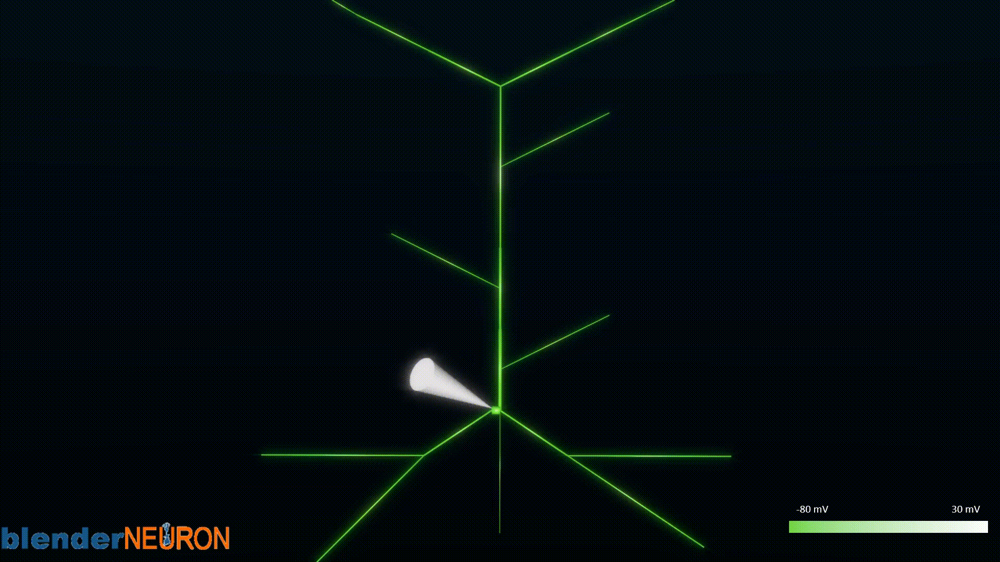
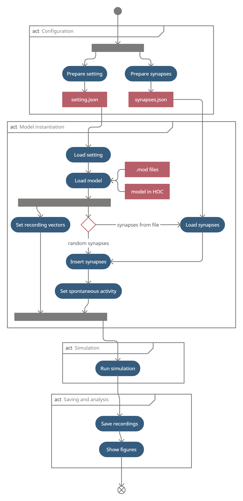

## CA1_plasticity

Code repository of the dissertation
thesis: [Computational model of synaptic plasticity in CA1 region of hippocampus](https://opac.crzp.sk/?fn=detailBiblioForm&sid=52328540584FDC4D928023AB80F2)
.

To run:

```
- git clone https://github.com/tomko-neuron/CA1_plasticity.git
```

- install packages in [requirements](./requirements.txt)

# CA1 pyramidal cell model

In simulations is used a reduced-morphology model for CA1 pyramidal cells. The model was optimized and tested
using [HippoUnit](https://github.com/KaliLab/hippounit). The model is assiociated with a
paper: [A new reduced-morphology model for CA1 pyramidal cells and its validation and comparison with other models using HippoUnit](https://www.nature.com/articles/s41598-021-87002-7)
and [GitHub repository](https://github.com/tomko-neuron/HippoUnit).



# Synaptic plasticity experiments

There are three defined experiments on synaptic plasticity. In all experiments, the voltage-based meta-STDP synaptic
plasticity rule described
in [Jedlicka et al. (2015)](https://journals.plos.org/ploscompbiol/article?id=10.1371/journal.pcbi.1004588) was
employed.

- **Experiment 1** implements the sequentional stimulation protocol as
  in [Dong et al. (2008)](https://journals.plos.org/plosone/article?id=10.1371/journal.pone.0002848) under the
  pentobarbital anesthesia.
- **Experiment 2** implements the high-frequency stimulation protocol and the paired-pulses stimulation protocol as
  in [Pavlowsky and Alarcon (2012)](https://pubmed.ncbi.nlm.nih.gov/22272255/).
- **Experiment 3** implements the theta burst stimulation protocol as
  in [Kim et al. (2015)](https://pubmed.ncbi.nlm.nih.gov/26247712/).

# Code organization

`CA1_plasticity.experiments`
This directory contains user-defined experiments. Each experiment has a defined directory that contains all the
necessary files and scripts. A typical experiment directory structure is illustrated for our “experiment1”.

`CA1_plasticity.experiments.experiment1`
The directory contains the `main.py` script that is used to run a simulation. The `figures` subdirectory contains saved
figures, the
`recordings` subdirectory contains saved recordings, the `settings` subdirectory contains all settings. This
subdirectory contains `setting.json` and `synapses.json` files needed for the simulation configuration and add synapses
to the model.

`CA1_plasticity.io`
This directory contains two classes used for data processing. The `IOHelper` class is used to load and save the settings
and recordings. The `FigureShower` class is used to visualize the recorded data. Several methods are defined in
the `FigureShower` class to plot the evolution of voltages, synaptic weights and ionic currents over time.

`CA1_plasticity.model`
This directory contains the classes and files needed to work with the model. The
`CA1PyramidalCell` class represents a model of the CA1 pyramidal cell. The constructor loads the model from a .hoc file.
The class defines methods for adding synapses, setting recording vectors and setting spontaneous activity.
The `StimulationProtocol` class is used to set a stimulation protocol. Each stimulation protocol is defined by its own
method and the parameters are defined in the `setting.json` file in the experiment directory (see above). The `mods`
directory contains additional .mod files that must be precompiled. They are loaded when the model is loaded.
The `hoc_models` directory contains the models defined in HOC.

# Typical workflow

A typical workflow consists of four main stages:

1. configuration
2. model instantiation
3. simulation
4. saving and analysis

